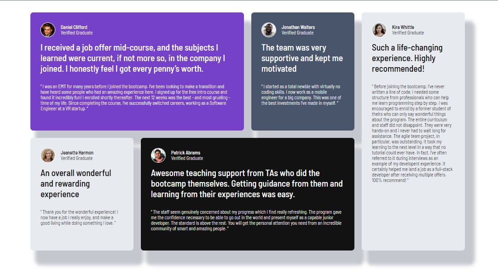

# Frontend Mentor - Testimonials grid section solution

This is a solution to the [Testimonials grid section challenge on Frontend Mentor](https://www.frontendmentor.io/challenges/testimonials-grid-section-Nnw6J7Un7). Frontend Mentor challenges help you improve your coding skills by building realistic projects. 

## Table of contents

- [Overview](#overview)
  - [The challenge](#the-challenge)
  - [Links](#links)
- [My process](#my-process)
  - [Built with](#built-with)
  - [What I learned](#what-i-learned)
  - [Continued development](#continued-development)
  - [Useful resources](#useful-resources)
- [Author](#author)

## Overview

### The challenge

Users should be able to:

- View the optimal layout for the site depending on their device's screen size

### Screenshot

### Links

- Solution URL: [Testimonial grid section](https://github.com/MauroDev35/Testimonial-grid-section)
- Live Site URL: [Testimonial grid section](https://github.com/MauroDev35/Testimonial-grid-section)

## My process

### Built with

I started by creating a mobile first version in order to set the cards accordingly, I made the layout for it then, the layout with grid for the desktop view and finally apply the CSS styles so it can looks beautiful. 

- Semantic HTML5 markup
- CSS custom properties
- Flexbox
- CSS Grid
- Mobile-first workflow

### What I learned

I learned how to use grid properly and using the grid template areas as well as grid area.

### Continued development

I want to continue learning about how to use flex grid and getting deeper on this powerfull tool.

### Useful resources

- [CSS Box Shadow Generator](https://10015.io/tools/css-box-shadow-generator) - This helped me for creating the box shadows for the cards.

## Author

- Frontend Mentor - [@MauroDev35](https://www.frontendmentor.io/profile/MauroDev35)
- Linkedin - [Andrés Mauricio Páez Vergara](www.linkedin.com/in/maurodev35)
